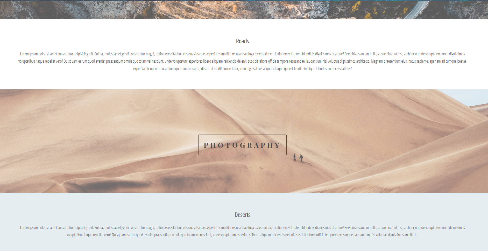

# Basic-responsive-parallax-site
- This is a basic resposive parallax website
- at widths below 568px, the css background-attachment property value changes to scroll
- at widths above 568px, the css background-attachment property value is fixed
## Folders and Files
- CSS folder contains styles.css file for the styles
- img folder contains images
- index.html 
- README.md
## Links
[See website here!](https://dulanjaleefl.github.io/Basic-responsive-parallax-site/)
## Build with
- HTML
- CSS
## Screenshot

